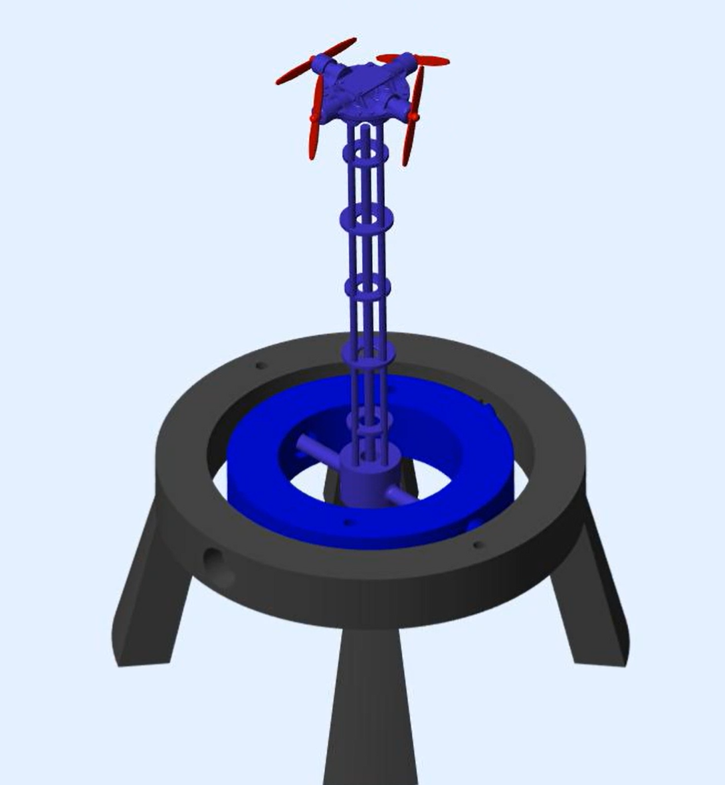

# 2dof Inverted Spherical Pendulum

## Overview
This project aims to keep an inverted pendulum (free to rotate about 2 axis) upright and balanced using orthogonally placed motors and propellors. Features include dedicated PID controllers, an extended Kalman filter for IMU sensor fusion, modeling system dynamics through Simulink, and hardware implementation through ESP32/Arduino components and CAD + 3D printing.

The goal of this project was to learn fundamentals of controls and design. Many of the components in this project are far from perfect, but they represent the time I’ve spent exploring a topic I care about.

### Here is the project broken up into its major sections, explained in further detail below:
- *CAD/Structure Design*
- *Simulation and Modeling*
- *Electronics, Controller Software, and Implementation*

### If you are interested in replicating or improving this project, here are the tools used:
*(These are just what I used, there are always better and more accessible options)*
- **CAD** -> Solidworks
- **3D printing** -> Cura, Ender 3
- **Simulation** -> Simulink
- **Controller Software** -> C++ (using an Arduino framework on Platform.io via VS Code)
- **Telemetry** -> VS Code Teleplot Extension

### Notable Materials/Items Used:
- ESP32 Dev Board
- Adafruit MPU-6050 6-DoF Accel and Gyro Sensor
- L298N DC Motor Driver Module (x2)
- LM2596 DC-DC Buck Power Converter Module
- 7x16 drone DC motors and propellers (x4)
- 18650 batteries (x2)
- 608 2RS Ball Bearings (x4)
- PLA filament rolls

## CAD/Structure Design
As mentioned before, all structural parts were custom made, 3D modeled and printed from PLA. This was to support the iterative process of building and testing prototypes, as well as enabling me to grow more on my knowledge of CAD and 3D printing. 

**The general structure can be mainly broken down into two sections:**
- The pendulum and supporting components
  - This includes the pendulum head (which houses the IMU and 4 motors), and the rod section (which extends the pendulum head down to the gimbal points).
- The bed
  - This includes the gimbal pieces which provide the 2 degrees of freedom, the stand which contains the pendulum, and the “electronics bay” which houses components such as the ESP32, battery, and motor control boards.
 
Within the CAD directory are both the .stl files and well as the Solidworks part + assembly files that were used to create this project.

## Simulation and Modeling

To model the pendulum’s dynamics and simulate the control logic used, I learned how to use Simulink. There are many things to refine as this is the first model I have made in Simulink, but below is the general functionalities and structure of the program:

- Implements PID control loops for each axis of control.
- Models dynamics via Euler-Lagrange equations of state as MATLAB functions.
- Mimics motor algorithms in controller code to show how a PID control output is being converted to a motor signal.
- Takes in parameters of real hardware
- Has the option to control the setpoint in real time to control the pendulum on user inputs.

**Simulation outputs**
- 3D visualization of pendulum performance 
- Plots of relevant data such as angles, setpoints, forces, and motor commands over time

## Electronics, Controller Software, and Implementation
To interface with the hardware, I utilized a C++ controller program which ran on an ESP32 that linked communication between the IMU and motors. The step is the culmination of the CAD and design work to create a physical model.

**Features:**
- To gather usable angular position data from the IMU, an extended Kalman filter was utilized for accelerometer and gyroscope sensor fusion.
- Using the VS Code Teleplot extension, the controller code could display IMU and motor data as moving plots.
- The controller code supported user interaction via serial commands, allowing the user to change the pendulum setpoint at any time or run preprogrammed setpoint control programs.

Through testing and tunning, the pendulum was able to balance, though only within a small range. After referencing the simulation model, controller code, and the hardware performance, the biggest limitation to stability was the time taken for the propellors to spin fast enough to produce the required thrust. While the pendulum’s performance was not robust as originally planned, further steps can be taken for the future of this project (which are explained in the section below)

## Future Steps
Overall, the large delay in the time that the propellors spin fast enough to provide the required torque prevents the level of stability that I am aiming for. Without much support, the pendulum fails to keep upright within a range larger than 5 degrees. In the future, I am planning to either account for this by implementing faster hardware or allowing the controller to better anticipate these delays. 

Additionally, I am hoping to increase the complexity of this project to allow me to dive deeper and apply more relevant concepts within controls. For example, I am considering adding another degree of freedom (rotation about the z axis), as well as integrating more complex controller logic such as LQR. Moreover, to better reflect the applicability of this project, I think it may be interesting to switch propulsion to cold gas thrusters to reflect a spacecrafts ability to use an RCS for attitude control.

To conclude, though the current set up is unable to bring the level of stability I was aiming for, I learned a lot through this process from software design to hardware implementation. I am determined to learn even more, and work on the ideas mentioned above to create a more sophisticated controls project.

